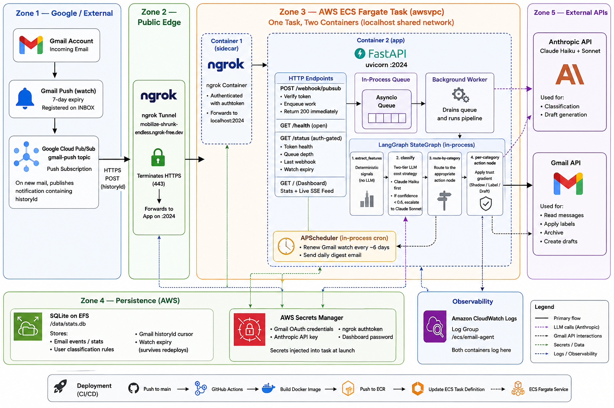

# email-agent

A LangGraph agent that triages incoming Gmail messages — classifies each one
(newsletter, receipt, calendar invite, personal, work, junk) and decides on a
label / archive / draft action.

**Status:** personal-only v1, **live in draft phase**. Real emails come in via
Gmail Push → Pub/Sub → webhook, get classified, labeled, and (for personal/work)
have a reply draft generated. Stats are persisted to SQLite and visible on a
real-time dashboard at `http://localhost:2024/` (served by the same process as
the webhook, so the SSE live feed works).

## Why

I wanted a LangGraph project that exercised more than checkpointing — multi-node
routing, conditional fan-out, trust-gated actions — and was useful enough I'd
actually run it against my own inbox. The design is intended to extend to
multiple users later, but v1 is just for me.

## Architecture



```
Gmail Push → Pub/Sub → POST /webhook/pubsub
                          │
                          ▼
START → extract_features → classify → [route by category] → action_<category> → END
                                                                  │
                                                                  ├─► Gmail API (label / archive / draft)
                                                                  ├─► SQLite stats
                                                                  └─► SSE → dashboard
```

The graph runs **in-process** inside a plain FastAPI app (`graph.ainvoke`), not
on a LangGraph Platform server. The webhook enqueues onto an in-process asyncio
queue and returns 200 immediately; a background worker drains it and runs the
graph. Only the open-source `langgraph` library (the `StateGraph` DSL) is used —
no licensed server runtime, Postgres, or Redis.

- **`extract_features`** — cheap deterministic signals (unsubscribe markers,
  links, sender domain). No LLM.
- **`classify`** — forced tool use on Anthropic's API. Two-tier cost strategy:
  Haiku first; if confidence is below 0.6, escalate to Sonnet.
- **Conditional routing** — the classifier's category picks one of the action
  subgraphs.
- **Action nodes** — build an `ActionPlan` (labels, archive, optional draft).
  Trust-phase-gated; see below.
- **Stats sink** — every processed email is inserted into `src/stats.db` (SQLite). The dashboard reads from SQLite.
- **Live feed** — action nodes call `events.publish(...)`; the payload is fanned
  out over SSE to the dashboard. Because the graph runs in the same process as
  the dashboard, the live feed works natively.
- **Batch review** — `POST /api/batch-review` fetches all unread inbox messages
  and runs each through the triage agent. Progress streams over SSE; the
  dashboard has a control panel with trust-phase selector, mark-read toggle,
  and max-emails input.

The classifier prompt is steered by a user-editable rules list in
[`core/rules.py`](src/agent/core/rules.py) — this is the chosen "learning"
mechanism, not adaptive fine-tuning. Edit those rules to nudge classification
behavior.

State lives in [`core/state.py`](src/agent/core/state.py) as a Pydantic model
and is updated immutably between nodes. Every node appends to `state.log` for
traceability.

### Trust gradient

Actions are gated behind an explicit trust phase the user opts into. Set via
the `TRUST_PHASE` env var:

1. **shadow** — log the plan, do nothing
2. **label** — apply Gmail labels
3. **archive** — label + archive out of inbox *(folded into `label`/`draft` plans)*
4. **draft** — generate draft replies for human review *(current default in `webapp.py`)*

Higher phases are not enabled by default and never will be — graduating happens
per-user, by choice.

## Quickstart

Requires Python 3.12 and [`uv`](https://github.com/astral-sh/uv).

```bash
# 1. Set up env
cp src/.env.example src/.env
# ...then fill in ANTHROPIC_API_KEY (LANGSMITH_* keys optional for tracing)

# 2. Run the FastAPI app (uvicorn with --reload) on :2024
make start
# Dashboard with live SSE feed is at http://localhost:2024/

# 3. Smoke-test against built-in fixtures
cd src/agent && uv run python -m agent.dev.smoke
```

For the live ingestion pipeline (Pub/Sub → webhook → graph) see
[Dev setup](#dev-setup-live-ingestion).

### Other commands

```bash
make backfill      # JSONL action logs → SQLite (idempotent)
make renew-watch   # renew the 7-day Gmail watch
make refresh-token # regenerate the Gmail OAuth refresh token (browser flow)
make digest        # run morning digest once
make format        # ruff format
make check         # ruff check --diff
make check-fix     # ruff check --fix
```

### Processes at a glance

The full application is two concurrent processes:

| Process | Command | What it does |
|---|---|---|
| FastAPI app | `make start` | Runs the graph (in-process), webhook, and dashboard on `:2024`. The only required process. |
| ngrok tunnel | `make ngrok` | Forwards GCP Pub/Sub push notifications to `localhost:2024`. Required for live ingestion; not needed when testing with fixtures. |

`make dashboard` starts a standalone stats UI on `:8765` for browsing historical data without `make start` — but the SSE live feed is inactive in that mode (separate process).

Scheduled tasks (`digest`, `renew_watch`) run inside the app process via APScheduler — not as separate processes. They're gated by `ENABLE_CRONS` (off in local dev, on in production), and on startup the app refreshes the Gmail watch when crons are enabled.

### Dev setup (live ingestion)

1. **Terminal 1:** `make start` — FastAPI app + dashboard on `:2024`
2. **Terminal 2:** `ngrok http --url=<your-domain> 2024` (or `make ngrok`)
3. `src/.env` needs at minimum: `ANTHROPIC_API_KEY`, `PUBSUB_VERIFICATION_TOKEN`, `TRUST_PHASE=draft`, and `GMAIL_CLIENT_ID/SECRET/REFRESH_TOKEN`
4. Gmail watch must be active — `make renew-watch` if it's stale (expires every 7 days)
6. Open `http://localhost:2024/` for the live dashboard

## Project layout

```
cloudformation/
  template.yml           # ECS Fargate stack (FastAPI app + ngrok sidecar, EFS, IAM)
  github-oidc.yml        # one-time GitHub Actions IAM role bootstrap
  secrets-template.json  # fill in and run `make secrets-create`

src/
  Dockerfile             # uv + uvicorn image (built by `make build` / CI)
  .env                   # ANTHROPIC_API_KEY, GMAIL_*, TRUST_PHASE, PUBSUB_*, ENABLE_CRONS
  stats.db               # SQLite stats DB + Gmail history cursor (gitignored)
  agent/
    pyproject.toml       # uv project root

    core/                # Graph pipeline (langgraph StateGraph DSL, run in-process)
      state.py           # Pydantic schema — read this first
      graph.py           # StateGraph wiring + conditional edges
      nodes.py           # extract_features, action_*, trust-phase gate, stats + SSE emit
      classifier.py      # Haiku → Sonnet escalation, forced tool use
      drafter.py         # Reply draft generation (greeting + "Best, Oscar Nolen" sign-off)
      rules.py           # User-editable classification rules

    ingestion/           # Email delivery: Gmail push → webhook → in-process graph run
      gmail_client.py    # OAuth2 + Gmail API (history, fetch, modify, watch, drafts, send)
      webapp.py          # FastAPI app: /webhook/pubsub + worker queue + scheduler + dashboard
      batch_review.py    # Bulk inbox review — fetches unread messages and runs each through the agent

    crons/               # Scheduled tasks (run in-process via APScheduler)
      digest.py          # Daily summary email from yesterday's SQLite events
      quick_digest.py    # Every-3h live Gmail list of new inbox mail (AI-independent)
      digest_render.py   # Shared MJML→HTML rendering for both digests
      renew_watch.py     # Watch-renewal (called by scheduler; also runnable standalone)

    stats/               # Persistence and dashboard UI
      db.py              # SQLite stats sink (portable schema, Postgres-ready)
      backfill.py        # One-off JSONL → SQLite import
      events.py          # In-process pub/sub bus that powers the dashboard SSE
      dashboard.py       # APIRouter with all dashboard routes; standalone app for make dashboard

    dev/                 # Developer tooling (not used in production)
      fixtures.py        # Sample emails for smoke testing
      smoke.py           # Runs the graph against all fixtures
```

## Stats & dashboard

- **`db.py`** — single `email_events` table; portable SQL (`?` params, ISO-8601
  text timestamps) so the AWS migration to Postgres is roughly a connect-call
  swap plus `AUTOINCREMENT` → `SERIAL`. Override path with `STATS_DB_PATH`.
- **`dashboard.py`** — inline HTML + Chart.js from CDN. Routes exposed via
  `APIRouter` and included in `webapp.py`, so they run in the same process as
  the ingestion webhook. Endpoints:
  - `GET /` — page (at `http://localhost:2024/` when `make start` is running)
  - `GET /api/stats` — totals, category breakdown, daily counts, top senders
  - `GET /api/events?limit=N` — recent events
  - `GET /api/stream` — SSE feed of live `email_processed` and batch-progress events
  - `POST /api/batch-review` — start a bulk inbox run
  - `GET /api/batch-review/status` — poll batch run state
- **SSE live feed** works because `dashboard.py` and `webapp.py` share a process
  (same in-memory `events.py` bus). `make dashboard` (`:8765`) is a standalone
  fallback that only has historical data.
- **Auth** — because the dashboard is mounted into the public webapp, every
  dashboard route requires HTTP Basic Auth (`DASHBOARD_USER`/`DASHBOARD_PASSWORD`)
  whenever `DASHBOARD_PASSWORD` is set; it's open when unset (local convenience).
  `/health` and `/webhook/pubsub` stay open (the webhook keeps its `?token=`
  check). `POST /api/batch-review` also clamps the requested trust phase to the
  deployment's `TRUST_PHASE` ceiling.

## Deployment

Runs on AWS ECS Fargate. Infrastructure is CloudFormation; CI/CD is GitHub Actions (OIDC, no long-lived keys). See `cloudformation/` and `make help` for deployment targets.

The ECS task runs two containers: the FastAPI app (built from `src/Dockerfile` — uvicorn on `:2024`) and an ngrok agent (keeps the existing static domain, no ALB needed). EFS provides persistent storage for the SQLite stats DB and the Gmail history cursor. All credentials live in AWS Secrets Manager. Crons (`ENABLE_CRONS=true` in prod) run in-process via APScheduler.

## Roadmap

In rough priority order:

1. **Classifier tuning** — iterate `rules.py` based on real-mail
   misclassifications; watch for over-escalation to Sonnet.
2. **Approval surface for drafts** — Slack / web UI / Gmail drafts (Gmail drafts
   is the current default; revisit when multi-tenant).

## License

Personal project. No license file yet.
